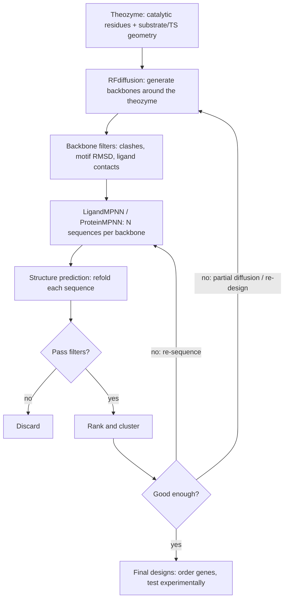

# Enzyme Design Pipeline: RFdiffusion + MPNN

Overview of the generative design loop used for theozyme-based enzyme design with Baker lab models (RFdiffusion, RFdiffusion2/3 for atomic-level active-site scaffolding, ProteinMPNN/LigandMPNN for sequence design). Verify model-specific details against each model's paper and repository before use.

## 1. Core idea

Design is a funnel. Each stage generates many candidates, and each filter discards most of them.

- **Backbone generation** (RFdiffusion family) proposes protein structures that hold the theozyme.
- **Sequence design** (ProteinMPNN / LigandMPNN) proposes amino acid sequences for each backbone.
- **Structure prediction** (AlphaFold2, RoseTTAFold2/RF3, Chai-1, etc.) checks whether each sequence folds back to the designed backbone.
- **Filtering and ranking** keep only designs that pass the metrics below.
- **Iteration** feeds the best designs back into the earlier stages.

## 2. Inputs: the theozyme

A theozyme is a theoretical enzyme active site: the transition state (or key intermediate) of the reaction plus the idealized catalytic residues arranged around it. It typically comes from QM calculations.

Inputs to prepare:
- Substrate / transition-state ligand coordinates (PDB/SDF) and its chemistry.
- Catalytic residues (identity, side-chain atom positions) placed around the ligand.
- Which atoms must be fixed (for atom-level motif scaffolding, only the functional atoms, not the whole residue, are fixed).
- Whether residue sequence positions are fixed or left for the model to choose (unindexed motifs).
- Target protein length range.

## 3. Stage-by-stage

### Stage A: Backbone generation (RFdiffusion)
- Diffuse a backbone from noise, conditioned on the theozyme motif.
- Run many samples (typically thousands) across a range of lengths and random seeds.
- Cheap quick filters: motif RMSD, ligand clashes, buried ligand fraction, secondary structure content, radius of gyration.

### Stage B: Sequence design (MPNN)
- Use **LigandMPNN** when the ligand and catalytic residues must be respected; ProteinMPNN if no ligand context is needed.
- Fix catalytic residue identities; design everything else.
- Sample multiple sequences per backbone (e.g. 8 to 32), at modest temperature (about 0.1 to 0.2) to trade diversity against recovery.
- Optionally bias or restrict amino acids (for example, exclude Cys, limit surface hydrophobics).

### Stage C: In silico validation (refolding)
- Predict structure of each sequence with an independent predictor.
- Compute:
  - **pLDDT** (confidence)
  - **Backbone RMSD** of prediction vs. designed backbone (self-consistency)
  - **Motif / active-site RMSD** (catalytic atoms vs. theozyme)
  - **Ligand placement** and pocket preorganization (a tool like PLACER or ChemNet-style predictor can assess side-chain ensembles)
  - Optional: Rosetta energies, shape complementarity, unsatisfied H-bonds

Example starting thresholds (tune per project): pLDDT > 80, backbone RMSD < 2 Å, motif RMSD < 1 Å.

### Stage D: Rank and cluster
- Combine metrics into a ranking.
- Cluster by structure/sequence so the final set is diverse rather than near-duplicates.

## 4. Iteration loops

Rarely does one pass succeed. Typical loops, from cheapest to most expensive:

| Loop | What repeats | When to use |
|------|--------------|-------------|
| Re-sample MPNN | Stage B and C on same backbones | Backbone is good, sequences fail to refold |
| Re-sample with constraints | Stage B with fixed/biased residues | Failures traced to particular residues |
| Partial diffusion | Noise a promising design a little, denoise, then B and C | Design is close, needs local improvement |
| Full re-diffusion | Stage A onward with adjusted motif/lengths | Backbones fail motif or pocket filters |
| Theozyme revision | Change active-site geometry | Many diverse backbones fail the same way |

Typical round structure:
1. Generate (~thousands of backbones).
2. Filter to hundreds.
3. Design ~8 to 32 sequences each.
4. Refold and filter to tens.
5. Take the top designs as seeds for partial diffusion, then repeat.
6. Stop when metrics plateau or enough diverse designs pass (often several rounds).

## 5. Final selection

- Manual inspection of top designs (catalytic geometry, substrate access, hydrogen-bond network).
- Check expression-friendliness (no odd sequence features, reasonable pI, no exposed hydrophobics).
- Order a diverse set; experimental activity then informs the next design cycle.

## 6. Repository mapping (planned)

| Stage | Planned location |
|-------|------------------|
| Theozyme prep | `src/theozyme/` |
| Backbone generation wrappers | `src/diffusion/` |
| MPNN wrappers | `src/sequence/` |
| Refolding and metrics | `src/validation/`, `shared_utils/metrics.py` |
| Iteration orchestration | `src/pipeline/` |

## 7. References

- Watson et al., RFdiffusion, *Nature* 2023.
- Dauparas et al., ProteinMPNN, *Science* 2022; LigandMPNN, *Nature Methods* 2025.
- Baker lab RFdiffusion2 (atom-level enzyme active-site scaffolding) and RFdiffusion3 preprints and repositories.
